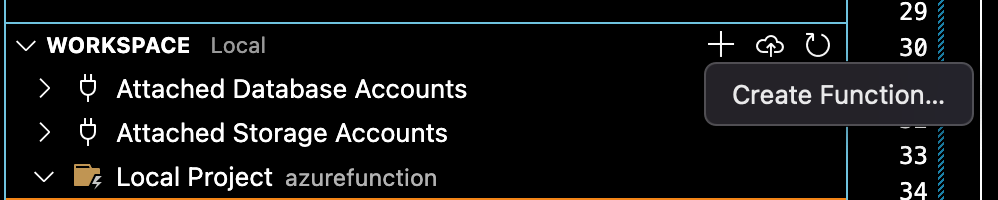
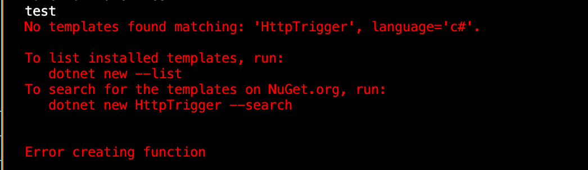
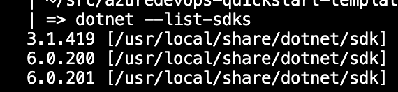

# Azure Functions

This folder contains a sample Azure Functions project with an Azure deployment pipeline example.  I created this example using the [documentation created by the Functions team](https://docs.microsoft.com/en-us/azure/azure-functions/create-first-function-vs-code-csharp?tabs=in-process) and I recommend that you get familiar with that doc in order to better understand what is in this folder.  The doc will tell you all the pre-requisites that you will need to run this project locally.

I did run into a few problems following the document above so I thought I would include them here in case it might be helpful to others.

- My VSCode Azure extension didn't have the Azure Functions view for some reason so I wasn't able to just `Create new Project`, so here is what I did to work around that
  - I did have a Workspace view where I could hit the + sign and select `Create Function`, but this failed for me as well.
    - 
  - The next thing I tried was using the Azure Functions Core Tools to create the [functions project](https://docs.microsoft.com/en-us/azure/azure-functions/functions-run-local?tabs=v4%2Cmacos%2Ccsharp%2Cportal%2Cbash#create-a-local-functions-project) and [function](https://docs.microsoft.com/en-us/azure/azure-functions/functions-run-local?tabs=v4%2Cmacos%2Ccsharp%2Cportal%2Cbash#create-func). Unfortunately this also failed for me with the following error
    - 
    - The reason for this error is that I had multiple versions of the `dotnet sdk` installed and it was confused as to which one to use.  Here is how I fixed this:
      - List all the versions of the sdk using `dotnet --list-sdks`
        - 
      - Choose the version you want to use.  In my case I want 3.1.419
      - Run `dotnet new globaljson` which will create a global.json file in your directory (make sure this is in the root directory) and update this file with the version you want to use.

        ```json
        {
            "sdk": {
                "version": "3.1.419"
            }
        }
        ```

      - Now you should be able to run the cli commands that you couldn't before (`func new`, `func init`) to create the function

## Folder Structure

Notice this doesn't follow our similar pattern of having an iac and src folder as siblings under the root folder.

```bash
 -resource (i.e. azurefunction)
   -src
   -iac
   azure-pipelines.yml
```

Instead it has all the src files under the root folder like this

```bash
 -resource (i.e. azurefunction)
   -iac
   -.vscode
   <all the src files/folders>
   azure-pipelines.yml
```

This is due to how the cli creates the functions app/project for you.  At some point I might go back and figure out if it can be modified by passing in a 'root', but my early attempts were unsuccessful so we have this for now.

## Local

To run the project locally, you will need to do the following:

### VS Code

- Clone repo
- Create new `src/local.settings.json` in project root and make sure it has the following variables:

    ```json
    {
        "IsEncrypted": false,
        "Values": {
            "AzureWebJobsStorage": "UseDevelopmentStorage=true",
            "FUNCTIONS_WORKER_RUNTIME": "dotnet"
        }
    }
    ```

### DevOps

The `azure-pipelines.yml` file represents an example of how you can build and deploy (CI/CD) this standard logic app into a lower and higher level environment from your source control repo.  This is fairly straight-forward pipeline, but I'll call out some things below to notice. I created this using the [documentation created by Functions team](https://docs.microsoft.com/en-us/azure/azure-functions/functions-how-to-azure-devops?tabs=dotnet-core%2Cyaml%2Ccsharp)

- The overall flow of the `azure-pipelines.yml` file is to package up the files that will be used to deploy the infrastructure and the code into artifacts, then deploy them to Azure.
  - The infrastructure piece is using Bicep templates and is stored in the `iac` folder.  This is all the templates you will need to create all the resources you need to stand-up a Functions App.
  - The code piece is stored in the `publish_output` folder that was created when I used the Publish task to publish the app.  That is what is getting archived into a `build${BuildId}.zip` file that gets deployed to Azure.

#### Parameters

*will be updated soon*